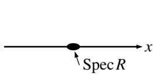
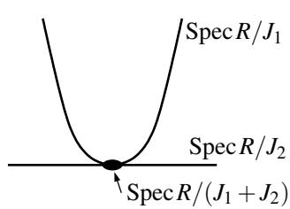
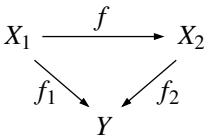

# 12. Schemes

So far in these notes we have introduced and studied varieties over an algebraically closed ground field $K$ as the main objects of algebraic geometry. Commutative algebra was a very useful tool for this as affine varieties and their morphisms correspond exactly to finitely generated reduced $K$ -algebras and their morphisms by Remark 4.16.

In order to make this correspondence between algebraic geometry and commutative algebra even stronger it is often useful to extend the category of affine varieties to include geometric objects for any ring instead of just for any finitely generated reduced $K$ -algebra. In other words, we will drop the assumptions of an algebraically closed ground field (in fact of any ground field at all) and of any kind of finite generation, and we will allow for nilpotent elements in the coordinate rings. This leads to the notion of affine schemes that we want to introduce in this chapter. Arbitrary schemes will then be objects glued from affine schemes in the same way as general varieties are glued from affine varieties. In many cases, schemes rather than varieties are considered to be the fundamental objects of study in algebraic geometry, in particular if a strong connection to commutative algebra is desired.

Schemes are ringed spaces just like varieties. So the general path of their construction is very similar to our previous work: First we will define affine schemes as sets, then as topological spaces, then as ringed spaces using a suitable structure sheaf, and finally we will consider spaces that are locally isomorphic to such affine schemes. We will therefore not repeat any arguments that are entirely analogous to the case of varieties, but rather stress the few important differences in the transition to schemes.

Let us start by defining affine schemes as sets.

Definition 12.1 (Affine schemes). Let $R$ be a ring. The set of all prime ideals of $R$ is called the spectrum of $R$ or the affine scheme associated to $R$ . We denote it by Spec R.

# Example 12.2.

(a) Clearly the main example of an affine scheme is obtained when $R = A ( X )$ is the coordinate ring of an affine variety $X$ over an algebraically closed ground field $K$ . We will then call Spec $R$ the affine scheme associated to $X$ ; in a sense that we will make precise in Proposition 12.33 it is the scheme-theoretic analogue of the affine variety $X$ . By Remark 2.9, it contains a point $I ( Y )$ for every irreducible subvariety $Y$ of $X$ . In particular, it contains an element $I ( \{ a \} )$ for every $a \in X$ .   
(b) As a special case of (a), the affine scheme $\operatorname { S p e c } K [ x ]$ associated to $\mathbb { A } _ { K } ^ { 1 }$ for an algebraically closed field $K$ consists of the points $\langle 0 \rangle$ and $\langle x - a \rangle$ for all $a \in K$ . In contrast, Spec $\mathbb { R } [ x ]$ contains additional points that are not of this form, as e. g. $P = \left. x ^ { 2 } + 1 \right.$ . We can think of $P$ geometrically as the pair of complex conjugate points $\{ \mathrm { i } , - \mathrm { i } \}$ in the extension $\mathbb { A } _ { \mathbb { C } } ^ { 1 }$ of $\mathbb { A } _ { \mathbb { R } } ^ { 1 }$ .   
(c) The affine scheme Spec $\mathbb { Z }$ consists of the points $\langle 0 \rangle$ and $\langle p \rangle$ for all prime numbers $p$ .

Remark 12.3. If $R$ is any ring and $J = \sqrt { \langle 0 \rangle }$ its nilradical, then $\operatorname { S p e c } ( R / J ) = \operatorname { S p e c } R$ since every prime ideal of $R$ has to contain $J$ . So the spectrum of a ring as a set cannot detect the presence of nilpotent elements. However, ${ \mathrm { S p e c } } ( R / J )$ and Spec $R$ will in general differ as ringed spaces (see Proposition 12.19).

In order to construct a Zariski topology on an affine scheme Spec R, we first have to define the analogue of polynomial functions on it. Motivated by the case of an affine scheme $\operatorname { S p e c } A ( X )$ associated to an affine variety $X$ , we see that the functions on Spec $R$ should be the elements of $R$ themselves. However, as there is no fixed ground field any more the values of a function at a point $P \in { \mathrm { S p e c } } R$ will lie in fields that depend on both $R$ and $P$ .

Definition 12.4 (Functions on affine schemes). Let $R$ be a ring, and let $P \in { \mathrm { S p e c } } R$ be a point in the corresponding affine scheme, i. e. a prime ideal $P \triangleleft R$ .

(a) We denote by $K ( P )$ the quotient field of the integral domain $R / P$ . It is called the residue field of Spec $R$ at $P$ .   
(b) For any $f \in R$ we define the value of $f$ at $P$ , written as $f ( P )$ , to be the image of $f$ under the composite ring homomorphism $R \to R / P \to K ( P )$ . In particular, we have $f ( P ) = 0$ if and only if $f \in P$ .

# Example 12.5.

(a) Let $R = A ( X )$ be the coordinate ring of an affine variety $X$ over an algebraically closed ground field $K$ , and let $P = I ( a ) \in { \mathrm { S p e c } } R$ be the (maximal) ideal of a point $a \in X$ . Then $R / P \cong K$ by evaluation of a polynomial function at $a$ , and hence Definition 12.4 (b) of $f ( P )$ agrees with the usual value $f ( a ) \in K$ as in Convention 1.1 (c). Similarly, if $P = I ( Y ) \in { \mathrm { S p e c } } R$ is the ideal of an irreducible subvariety $Y \subset X$ then $f ( P )$ is the restriction of $f$ to $Y$ , considered as an element in the function field $K ( Y )$ as in Construction 9.7 (see also Remark 9.8 (b)).   
(b) On Spec $\mathbb { Z }$ , the value of the function $a \in \mathbb { Z }$ at a point $\langle p \rangle \in \mathrm { S p e c } \mathbb { Z }$ for a prime number $p$ is just its class ${ \overline { { a } } } \in \mathbb { Z } _ { p }$ .

Definition 12.6 (Zero loci and ideals in affine schemes). Let $R$ be a ring.

(a) For a subset $S \subset R$ , we define the zero locus of $s$ to be the set

$$
V ( S ) : = \{ P \in { \mathrm { S p e c } } R : f ( P ) = 0 { \mathrm { ~ f o r ~ a l l ~ } } f \in S \} \quad \subset { \mathrm { S p e c } } R .
$$

As usual, if $S = \{ f _ { 1 } , \ldots , f _ { k } \}$ is a finite set, we will write $V ( S )$ also as $V ( f _ { 1 } , \ldots , f _ { k } )$

(b) For a subset $X \subset \operatorname { S p e c } R$ , we define the ideal of $X$ to be

$$
I ( X ) : = \{ f \in R : f ( P ) = 0 { \mathrm { ~ f o r ~ a l l ~ } } P \in X \} \quad \triangleleft R .
$$

(Note that this is in fact an ideal since evaluation at $P$ is a ring homomorphism by definition.)

# Remark 12.7.

(a) As $f ( P ) = 0$ if and only if $f \in P$ , we can reformulate Definition 12.6 as

$$
\begin{array} { r l } & { V ( S ) = \{ P \in \mathrm { S p e c } R : f \in P \mathrm { ~ f o r ~ a l l ~ } f \in S \} = \{ P \in \mathrm { S p e c } R : P \supset S \} } \\ { \mathrm { a n d ~ } } & { I ( X ) = \displaystyle \bigcap _ { P \in X } P . } \end{array}
$$

(b) One might ask why we define the value of $f \in R$ at a point $P \in { \mathrm { S p e c } } R$ to lie in the quotient field of $R / P$ , instead of in $R / P$ itself. In fact, for Definition 12.6 this would not make any difference. The reason for this is that — just as for affine varieties — later in Definition 12.16 and Remark 12.17 (b) we will construct regular functions on affine schemes as objects that are locally represented by quotients of elements of $R$ , and they should have values at points of Spec $R$ as well.

Even if our Definition 12.4 (b) of values is probably unexpected, the fact that evaluation at a point of Spec $R$ is still a ring homomorphism and takes values in a field means that most properties of the operations $V ( \cdot )$ and $I ( \cdot )$ together with their proofs carry over immediately from the case of varieties. In particular, both operations reverse inclusions, and we clearly have $V ( S ) = V { \bigl ( } \langle S \rangle { \bigr ) }$ for any $S \subset R$ . Moreover, as in Lemma 1.4 we see that $V ( S _ { 1 } ) \cup V ( S _ { 2 } ) = V ( S _ { 1 } S _ { 2 } )$ and $\begin{array} { r } { \bigcap _ { i \in J } V ( S _ { i } ) = V ( \bigcup _ { i \in J } S _ { i } ) } \end{array}$ for all $S _ { i } \subset R$ and any index set $J$ . As in addition we have $V ( 1 ) = \emptyset$ and $V ( 0 ) = { \mathrm { S p e c } } R$ , the latter means that we can obtain a topology on Spec $R$ in the usual way:

Definition 12.8 (Zariski topology). We define the Zariski topology on an affine scheme Spec $R$ to be the topology whose closed sets are exactly the sets of the form $V ( S ) = \{ P \in { \mathrm { S p e c } } R : P \supset S \}$ for some $S \subset R$ .

In the following, we will always consider an affine scheme as a topological space in this way.

# Remark 12.9.

(a) Of course, Definition 12.8 means that all topological concepts like connectedness, irreducibility, and dimension immediately apply to affine schemes.

(b) Compared to the case of affine varieties, a new feature of the Zariski topology on affine schemes is that points are not necessarily closed. In fact, for a point $P$ in an affine scheme Spec $R$ we have

$$
{ \overline { { \{ P \} } } } = V ( P ) = \{ Q \in { \mathrm { S p e c } } R : Q \supset P \} ,
$$

so that $\{ P \}$ is closed, i. e. we have $\overline { { \{ P \} } } = \{ P \}$ , if and only if $P$ is a maximal ideal.

For an affine scheme $\operatorname { S p e c } A ( X )$ associated to an affine variety $X$ , this means that the closed points of Spec A $( X )$ correspond exactly to the minimal subvarieties of $X$ , i. e. to the points of the variety $X$ in the usual sense. The other non-closed points of $\operatorname { S p e c } A ( X )$ are of the form $I ( Y )$ for a positive-dimensional irreducible affine subvariety $Y$ of $X$ . Such a point $I ( Y ) \in { \mathrm { S p e c } } A ( X )$ is usually called the generic or general point of $Y$ . One motivation for this name is that evaluation at $Y$ takes values in the function field $K ( Y )$ of $Y$ , which encodes rational functions on $Y$ , i. e. regular functions that are not necessarily defined on all of $Y$ , but only at a “general point” of $Y$ .

These additional non-closed points are sometimes important, but in many cases one can actually ignore them. Often one adopts the convention that a point of an affine scheme Spec $R$ is always meant to be a closed point, i. e. a maximal ideal of $R$ , and hence a “usual point of $X ^ { \dag }$ in the case of an affine scheme associated to an affine variety $X$ .

As expected, there is also an analogue of the Nullstellensatz for affine schemes.

Proposition 12.10 (Scheme-theoretic Nullstellensatz). Let R be a ring.

(a) For any closed subset $X \subset \operatorname { S p e c } R$ we have $V ( I ( X ) ) = X$ .   
(b) For any ideal $J \triangleleft R$ we have $I ( V ( J ) ) = \sqrt { J }$ .

In particular, $V ( \cdot )$ and $I ( \cdot )$ induce an inclusion-reversing bijection

$$
\{ c l o s e d s u b s e t s ~ o f { \mathrm { S p e c } } R \} ~ \stackrel {  \downarrow : } { \longleftrightarrow } ~ \{ r a d i c a l ~ i d e a l s ~ i n ~ R \} .
$$

Proof. In the same way as for affine varieties, only the “ $\subset$ ” part of (b) is non-trivial. But this is also easy to see: By Remark 12.7 (a) it follows that

$$
I ( V ( J ) ) = \bigcap _ { P \in V ( J ) } P = \bigcap _ { P \in \mathrm { { S p e c } } R } P = { \sqrt { J } } ,
$$

where the last equation is a standard commutative algebra result [G3, Lemma 2.21].

Remark 12.11 (Properties of $V ( \cdot )$ and $I ( \cdot ) \rangle$ ). The usual properties of $V ( \cdot )$ and $I ( \cdot )$ as in Lemmas 1.7 and 1.12 follow immediately from their definitions together with the Nullstellensatz, and hence hold for affine schemes as well:

(a) For any two ideals $J _ { 1 } , J _ { 2 }$ in a ring $R$ we have

$$
V ( J _ { 1 } ) \cup V ( J _ { 2 } ) = V ( J _ { 1 } J _ { 2 } ) = V ( J _ { 1 } \cap J _ { 2 } ) \quad { \mathrm { a n d } } \quad V ( J _ { 1 } ) \cap V ( J _ { 2 } ) = V ( J _ { 1 } + J _ { 2 } )
$$

in Spec $R$ .

(b) For any two closed subsets $X _ { 1 } , X _ { 2 }$ of Spec $R$ we have

$$
I ( X _ { 1 } \cup X _ { 2 } ) = I ( X _ { 1 } ) \cap I ( X _ { 2 } ) \quad { \mathrm { a n d } } \quad I ( X _ { 1 } \cap X _ { 2 } ) = { \sqrt { I ( X _ { 1 } ) + I ( X _ { 2 } ) } } .
$$

As in the case of affine varieties in Definition 3.6, there is a notion of distinguished open subsets of an affine scheme that plays an important role when studying topological properties.

Definition 12.12 (Distinguished open subsets). For a ring $R$ and an element $f \in R$ , we call

$$
D ( f ) : = { \mathrm { S p e c } } R \backslash V ( f ) = \{ P \in { \mathrm { S p e c } } R : f \notin P \}
$$

the distinguished open subset of $f$ in Spec $R$ .

Remark 12.13. As for affine varieties, the distinguished open subsets form a basis of the topology of an affine scheme SpecR in the sense that every open subset $U \subset \operatorname { S p e c } R$ is a (not necessarily finite) union of distinguished opens: As $U$ has to be of the form $U = { \mathrm { S p e c } } R \backslash V ( S )$ for some $S \subset R$ , we conclude that

$$
U = { \mathrm { S p e c } } R \backslash \bigcap _ { f \in S } V ( f ) = \bigcup _ { f \in S } \left( { \mathrm { S p e c } } R \backslash V ( f ) \right) = \bigcup _ { f \in S } D ( f ) .
$$

Exercise 12.14. Find an example of the following, or prove that it does not exist:

(a) an irreducible affine scheme Spec $R$ such that $R$ is not an integral domain;   
(b) two affine schemes Spec $R$ and Spec $s$ with $R \leq S$ and $\dim { \mathrm { S p e c } } R > \dim { \mathrm { S p e c } } S ;$ ;   
(c) a point of Spec $\mathbb { R } [ x _ { 1 } , x _ { 2 } ] / \langle x _ { 1 } ^ { 2 } + x _ { 2 } ^ { 2 } + 1 \rangle$ with residue field $\mathbb { R }$ ;   
(d) an affine scheme of dimension 1 with exactly two points.

# Exercise 12.15.

(a) Let $R = A ( X )$ be the coordinate ring of an affine variety $X$ over an algebraically closed field. Show that the set of all closed points is dense in Spec $R$ (which means by definition that every non-empty open subset of Spec $R$ contains a closed point).   
(b) In contrast to (a) however, show by example that on a general affine scheme the set of all closed points need not be dense.

After having studied the topology of affine schemes, we now have to give them the structure of a ringed space by defining regular functions on them. To do this, note that we cannot just copy Definition 3.1 for affine varieties since we no longer have a ground field to which functions can map. Instead, recall by Lemma 3.19 that local regular functions on an affine variety $X$ around a point $a \in X$ are described by the local rings ${ \mathcal { O } } _ { X , a } = A ( X ) _ { I ( a ) }$ . Correspondingly, the idea to define a regular function on an open subset $U$ of an affine scheme Spec $R$ is that we should give a “local function” in the localization $R _ { P }$ for each $P \in U$ — and again as in the case of varieties require that they are locally of the form $\textstyle { \frac { g } { f } }$ for suitable $f , g \in R$ . This leads to the following definition.

Definition 12.16 (Regular functions). Let $R$ be a ring, and let $U$ be an open subset of the affine scheme SpecR. A regular function on $U$ is a family $\varphi = ( \varphi _ { P } ) _ { P \in U }$ with $\varphi _ { P } \in R _ { P }$ for all $P \in U$ , such that the following property holds: For every $P \in U$ there are $f , g \in R$ with $f \not \in Q$ and

$$
\varphi _ { Q } = { \frac { g } { f } } \in R _ { Q }
$$

for all $Q$ in an open subset $U _ { P }$ with $P \in U _ { P } \subset U$ .

The set of all such regular functions on $U$ is clearly a ring; we will denote it by $\mathcal { O } _ { \mathrm { S p e c } R } ( U )$ . Moreover, as the condition imposed on $\varphi$ is local it is obvious that $\mathcal { O } _ { \mathrm { S p e c } R }$ is a sheaf. It is called the structure sheaf of Spec R.

# Remark 12.17.

(a) As in the case of varieties, we will write the condition “ $\begin{array} { r } { \varphi _ { Q } = \frac { g } { f } \in R _ { Q } } \end{array}$ for all $Q \in { U _ { P } } ^ { \prime }$ ” simply as “ $\textstyle { \dot { \varphi } } = { \frac { g } { f } }$ on $U _ { P } { } ^ { \prime }$ . (b) For a prime ideal $P$ in a ring $R$ , the quotient $R _ { P } / P _ { P }$ of the local ring $R _ { P }$ by its maximal ideal $P _ { P }$ is just the residue field $K ( P )$ of Definition 12.4 (a). Hence, analogously to Definition 12.4 (b), any regular function $\varphi \in { \mathcal { O } } _ { \operatorname { S p e c } R } ( U )$ has a well-defined value $\varphi ( P ) \in K ( P )$ for all $P \in U$ , namely the class of $\varphi _ { P } \in R _ { P }$ in $K ( P )$ . However, in contrast to the case of affine varieties we will see in 12.20 (a) that a regular function on an affine scheme is not determined by its values.

The motivation for Definition 12.16 was that the local rings $R _ { P }$ for a point $P \in { \mathrm { S p e c } } R$ should describe local functions on Spec $R$ around $P$ . Hence, let us quickly check that in accordance with this idea the stalks $\mathcal { O } _ { \operatorname { S p e c } R , P }$ of the structure sheaf at $P$ (in the sense of Construction 3.17) are in fact isomorphic to these local rings.

Lemma 12.18 (Stalks of regular functions). Let R be a ring. Then for any point $P \in { \mathrm { S p e c } } R$ the stalk $\mathcal { O } _ { \operatorname { S p e c } R , P }$ of the structure sheaf $\mathcal { O } _ { \mathrm { S p e c } R }$ at $P$ is isomorphic to the localization $R _ { P }$ .

Proof. There is a well-defined ring homomorphism

$$
\mathcal { O } _ { \mathrm { S p e c } R , P }  R _ { P } , \overline { { ( U , \varphi ) } } \mapsto \varphi _ { P }
$$

that maps the class of a family $\varphi = ( \varphi _ { Q } ) _ { Q \in U } \in \mathcal { O } _ { \mathrm { S p e c } R } ( U )$ in the stalk $\mathcal { O } _ { \operatorname { S p e c } R , P }$ to its element at $Q = P$ . We will show that it is a bijection.

It is clearly surjective since any element of $R _ { P }$ is of the form $\frac { g } { f }$ with $f , g \in R$ and $f \notin P$ , and hence is the image of $( D ( f ) , { \frac { g } { f } } )$ .

To show injectivity, let $\varphi \in { \mathcal { O } } _ { \operatorname { S p e c } R } ( U )$ for some $U \ni P$ be such that $\varphi _ { P } = 0$ . By shrinking $U$ if necessary we may assume by Definition 12.16 that $\textstyle \varphi = { \frac { g } { f } } $ on $U$ for some $f , g \in R$ . In particular, we have $\textstyle { \frac { g } { f } } = 0 \in R _ { P }$ , which means that $h g = 0$ for some $h \not \in P$ . But then we also have $\textstyle { \frac { g } { f } } = 0 \in R _ { Q }$ for all $Q \in U \cap D ( h )$ . Hence $\varphi = 0$ on the open neighborhood $U \cap D ( h )$ of $P$ , which means that its germ is zero in OSpecR,P. □

Of course, Definition 12.16 is not very useful to work with regular functions in practice. The following proposition, which describes regular functions on distinguished open subsets and is entirely analogous to Proposition 3.8, provides a much more convenient description.

Proposition 12.19 (Regular functions on distinguished open subsets). Let $R$ be a ring and $f \in R$ .   
Then $\mathcal { O } _ { \mathrm { S p e c } R } ( D ( f ) )$ is isomorphic to the localization $R _ { f }$ .

In particular, setting $f = 1$ we see that the global regular functions are $\mathcal { O } _ { \mathrm { S p e c } R } \big ( \mathrm { S p e c } R \big ) \cong R .$ .

Proof. There is a well-defined ring homomorphism

$$
R _ { f } \mapsto { \mathcal { O } } _ { \operatorname { S p e c } R } ( D ( f ) ) , { \frac { g } { f ^ { r } } } \mapsto { \frac { g } { f ^ { r } } }
$$

that maps $\textstyle { \frac { g } { f r } } \in R _ { f }$ to the family $\varphi = ( \varphi _ { P } ) _ { P \in D ( f ) }$ with $\begin{array} { r } { \varphi _ { P } = { \frac { g } { f ^ { r } } } \in R _ { P } } \end{array}$ for all $P \in D ( f )$ . We have to prove that it is bijective.

To show that it is injective let $g \in R$ and $r \in \mathbb { N }$ such that $\begin{array} { r } { \frac { g } { f r } = 0 } \end{array}$ on $D ( f )$ . For all $P \in D ( f )$ this means that $\textstyle { \frac { g } { f r } } = 0 \in R _ { P }$ , i. e. there is an element $h \not \in P$ with $h g = 0$ , showing that $P \ \mathscr { Z } \ J : = \{ h \in R : h g = 0 \}$ , and consequently $P \notin V ( J )$ by Remark 12.7 (a). In other words, we have $V ( J ) \subset V ( f )$ , and hence $f \in { \sqrt { \langle f \rangle } } \subset { \sqrt { J } }$ by the Nullstellensatz of Proposition 12.10. This means that $f ^ { k } \in J$ for some $k \in \mathbb N$ , i. e. $f ^ { k } g = 0$ by definition of $J$ , and thus $\textstyle { \frac { g } { f r } } = 0 \in R _ { f }$ . Hence, the map $( * )$ is injective.

Surjectivity of $( * )$ is harder, but follows closely the proof of the analogous statement of Proposition 3.8 for affine varieties. Let $\varphi \in { \mathcal { O } } _ { \operatorname { S p e c } R } ( D ( f ) )$ . By definition, for each $P \in D ( f )$ there are $f _ { P } , g _ { P } \in R$ such that $\textstyle \varphi = { \frac { g _ { P } } { f _ { P } } } $ on some open neighborhood $U _ { P }$ of $P$ in $D ( f )$ with $U _ { P } \subset D ( f _ { P } )$ . As the distinguished open subsets form a basis for the topology of Spec $R$ , we may assume that $U _ { P } = D ( h _ { P } )$ for some $h _ { P } \in R$ .

We want to show that we can assume $f _ { P } = h _ { P }$ for all $P$ . In fact, as $D ( h _ { P } ) \subset D ( f _ { P } )$ , which means that $V ( f _ { P } ) \subset V ( h _ { P } )$ , we have $h _ { P } \in \sqrt { \langle h _ { P } \rangle } \subset \sqrt { \langle f _ { P } \rangle }$ by Proposition 12.10. Hence $h _ { P } ^ { r } = c f _ { P }$ for some $r \in \mathbb { N }$ and $c \in R$ , so that $\begin{array} { r } { \frac { g _ { P } } { f _ { P } } = \frac { c g _ { P } } { h _ { P } ^ { r } } } \end{array}$ . Replacing $f _ { P }$ by $h _ { P } ^ { r }$ (with $D ( f _ { P } ) = D ( h _ { P } ) )$ and $g _ { P }$ by $c g _ { P }$ we can thus assume that $D ( f )$ is covered by open subsets of the form $D ( f _ { P } )$ , and that $\textstyle \varphi = { \frac { g _ { P } } { f _ { P } } } $ on $D _ { f _ { P } }$ .

Next we prove that $D ( f )$ can actually be covered by finitely many such distinguished opens $D ( f _ { P } )$ . Indeed, $D ( f ) \subset \bigcup _ { P } D ( f _ { P } )$ is equivalent to $\begin{array} { r } { V ( f ) \supset \bigcap _ { P } V ( f _ { P } ) = V \bigl ( \sum _ { P } \langle f _ { P } \rangle \bigr ) } \end{array}$ , so to $\sqrt { \langle f \rangle } \subset \sqrt { \sum _ { P } \langle f _ { P } \rangle }$ by Proposition 12.10, i. e. to $\textstyle f ^ { r } \in \sum _ { P } \left. f _ { P } \right.$ for some $r \in \mathbb { N }$ . But this means that $f ^ { r }$ can be written as a finite sum $\begin{array} { r } { f ^ { r } = \sum _ { P } k _ { P } f _ { P } } \end{array}$ with $k _ { P } \in R$ . Hence we only have to consider finitely many $P$ .

On the distinguished open subset $D ( f _ { P } ) \cap D ( f _ { Q } ) = D ( f _ { P } f _ { Q } )$ for some $P$ and $Q$ , we now have two fractions $\frac { g _ { P } } { f _ { P } }$ and $\frac { g _ { Q } } { f _ { Q } }$ representing $\varphi$ . So by the injectivity proven above it follows that $\begin{array} { r } { \frac { g _ { P } } { f _ { P } } = \frac { g _ { Q } } { f _ { Q } } } \end{array}$ gQ in $R _ { f _ { P } f _ { Q } }$ , i. e. that $( \tilde { f _ { P } f _ { Q } } ) ^ { n } ( g _ { P } f _ { Q } - g _ { Q } f _ { P } ) = 0 \in R$ for some $n$ . As we have only finitely many $P$ and $Q$ to consider, we may pick one $n$ that works for all of them. Now replace $g _ { P }$ by $g _ { P } f _ { P } ^ { n }$ and $f _ { P }$ by $f _ { P } ^ { n + 1 }$ for all $P$ . Then $\varphi$ is still represented by $\frac { g _ { P } } { f _ { P } }$ on $D ( f _ { P } )$ , and moreover $g _ { P } f _ { Q } - g _ { Q } f _ { P } = 0$ for all $P , Q$ .

Finally, write $\begin{array} { r } { f ^ { r } = \sum _ { P } k _ { P } f _ { P } } \end{array}$ as above, and set $\begin{array} { r } { g = \sum _ { P } k _ { P } g _ { P } } \end{array}$ . Then for every $Q$ we have

$$
g f _ { Q } = \sum _ { P } k _ { P } g _ { P } f _ { Q } = \sum _ { P } k _ { P } g _ { Q } f _ { P } = f ^ { r } g _ { Q } ,
$$

$\begin{array} { r } { \frac { g } { f r } = \frac { g _ { Q } } { f _ { Q } } } \end{array}$ on $D ( f _ { Q } )$ for all $Q$ . Hence $\varphi$ is represented by $\textstyle { \frac { g } { f r } } \in R _ { f }$ on all of $D ( f )$

# Example 12.20.

(a) (Double points) Let $R = K [ x ] / \langle x ^ { 2 } \rangle$ for a field $K$ . Then $x$ is nilpotent in $R$ , and hence on the affine scheme Spec $R$ the ring $\mathcal { O } _ { \mathrm { S p e c } R } ( \mathrm { S p e c } R ) \overset { ^ { 1 2 . 1 9 } } { = } R$ of global regular functions has nilpotent elements — which is something that cannot happen for an affine variety $X$ since its coordinate ring $A ( X )$ is always a quotient of a polynomial ring by a radical ideal $I ( X )$ .

More precisely, the global regular functions on Spec $R$ are of the form $\varphi = a + b x$ for $a , b \in K$ Note that Spec $R$ has only one point $P = \langle x \rangle$ , and that $\varphi ( P ) = a \in R / \langle x \rangle = K = K ( P )$ . Hence we can also see from this example that a regular function need not be determined by its values at all points.

Geometrically, one can think of Spec $R$ as “a point that extends infinitesimally in one direction”: As on the affine line $\mathbb { A } _ { K } ^ { 1 }$ , there are polynomial functions in one variable on Spec $R$ , but the space is such an infinitesimally small neighborhood of the origin that we can only see the linearization of the functions on it, and that it does not contain any actual points except 0.

It is usually called a double point or a fat point over $K$ , with the word “double” referring to the vector space dimension of $R$ over $K$ (see also Exercise 12.42).

(b) On the affine scheme Spec $\mathbb { Z }$ consider the open subset

$$
D ( 6 ) = \{ \langle 0 \rangle \} \cup \{ \langle p \rangle : p \neq 2 , 3 { \mathrm { ~ p r i m e } } \} \quad \subset \operatorname { S p e c } \mathbb { Z } .
$$

With the isomorphism of Proposition 12.19 the fraction $\textstyle \varphi = { \frac { 5 } { 6 } }$ in the localization of $\mathbb { Z }$ at the set $\{ 6 ^ { n } : n \in \mathbb { N } \}$ is a well-defined regular function on $D ( 6 )$ , and its values correspond to the ways this fraction can be interpreted in different fields:

• $\varphi ( \langle 0 \rangle )$ is the rational number $\begin{array} { r } { \frac { 5 } { 6 } \in \mathbb { Q } = K \big ( \langle 0 \rangle \big ) } \end{array}$ .   
• $\varphi ( \langle p \rangle )$ for $p \neq 2 , 3$ is the element $\overline { { 5 } } \cdot \overline { { 6 } } ^ { - 1 }$ in the field $\mathbb { Z } / p \mathbb { Z } = K ( \langle p \rangle )$ , so e. g. $\varphi$ has a zero at $\langle 5 \rangle$ and $\varphi ( \langle 1 1 \rangle ) = { \overline { { 5 } } } \cdot { \overline { { 2 } } } = { \overline { { 1 0 } } } \in \mathbb { Z } / 1 1 \mathbb { Z }$ .

Exercise 12.21. Let $R$ be a ring. Prove that the affine scheme Spec $R$ is disconnected if and only if $R \cong S \times T$ for two non-zero rings $s$ and $T$ .

With affine schemes defined as ringed spaces, one might hope that we can now go ahead as before and define morphisms of affine schemes just as morphisms of ringed spaces. There is a slight problem with this however, which is due to our simplification in Convention 4.2: We have defined a morphism between two ringed spaces $X$ and $Y$ as a continuous map $f \colon X \to Y$ that pulls back regular functions to regular functions, i. e. such that $f ^ { * } \varphi \in { \mathcal { O } } _ { X } ( f ^ { - 1 } ( U ) )$ for any regular function $\varphi \in { \mathcal { O } } _ { Y } ( U )$ on an open subset $U$ . However, our definition $f ^ { * } \varphi : = \varphi \circ f$ of the pull-back is purely set-theoretic and can only be used to consider values of functions — but we have just seen in Example 12.20 (a) that a regular function on an affine scheme is in general not determined by its values.

The only way around this problem is to include all pull-backs $f ^ { * } \colon { \mathcal { O } } _ { Y } ( U ) \to { \mathcal { O } } _ { X } ( f ^ { - 1 } ( U ) )$ into the data that has to be given to define a morphism. Of course, these a priori arbitrary ring homomorphisms then need to satisfy a certain compatibility condition with the continuous map $f \colon X \to Y$ . To motivate this compatibility condition, let us have a look at the case of (pre-)varieties again.

Remark 12.22. Let $f \colon X \to Y$ be a morphism of (pre-)varieties. For all open subsets $U \subset Y$ the pull-back maps $f ^ { * } \colon { \mathcal { O } } _ { Y } ( U ) \to { \mathcal { O } } _ { X } ( f ^ { - 1 } ( U ) )$ are compatible with restrictions, and hence determine well-defined ring homomorphisms $f _ { a } ^ { * } \colon { \mathcal { O } } _ { Y , f ( a ) } \to { \mathcal { O } } _ { X , a }$ between the stalks for all $a \in X$ . Now recall that these stalks are local rings by Lemma 3.19, with maximal ideals

$$
I _ { a } = \{ \varphi \in { \mathcal O } _ { X , a } : \varphi ( a ) = 0 \} \quad \mathrm { a n d } \quad I _ { f ( a ) } = \{ \varphi \in { \mathcal O } _ { Y , f ( a ) } : \varphi ( f ( a ) ) = 0 \} ,
$$

respectively. Hence we have

$$
( f _ { a } ^ { * } ) ^ { - 1 } ( I _ { a } ) = \{ \varphi \in { \mathcal { O } } _ { Y , f ( a ) } : ( f ^ { * } \varphi ) ( a ) = 0 \} = \{ \varphi \in { \mathcal { O } } _ { Y , f ( a ) } : \varphi ( f ( a ) ) = 0 \} = I _ { f ( a ) } ,
$$

i. e. the local maps $f _ { a } ^ { * } \colon { \mathcal { O } } _ { Y , f ( a ) } \to { \mathcal { O } } _ { X , a }$ have the property that the inverse image of the maximal ideal of ${ \mathcal { O } } _ { X , a }$ is the maximal ideal of $\mathcal { O } _ { Y , f ( a ) }$ . As the stalks of the structure sheaf of an affine scheme are local rings as well by Lemma 12.18, we can use this as compatibility condition between the topological map $f$ and the pull-backs $f ^ { * }$ ; we just have to include this requirement of these stalks being local rings into our definition of ringed spaces.

Definition 12.23 (Locally ringed spaces). A locally ringed space is a ringed space $( X , { \mathcal { O } } _ { X } )$ such that each stalk $\mathcal { O } _ { X , P }$ for $P \in X$ is a local ring.

# Example 12.24.

(a) By Lemma 3.19, every (pre-)variety is a locally ringed space.   
(b) Every open subset of a locally ringed space, together with the restricted structure sheaf as in Definition 3.16, is again a locally ringed space.   
(c) By Lemma 12.18, every affine scheme (and hence by (b) also every open subset of an affine scheme) is a locally ringed space.

Definition 12.25 (Morphisms of locally ringed spaces). A morphism of locally ringed spaces from $( X , { \mathcal { O } } _ { X } )$ to $( Y , { \mathcal { O } } _ { Y } )$ is given by the following data:

• a continuous map $f \colon X \to Y$ ;   
• for every open subset $U \subset Y$ a ring homomorphism $f _ { U } ^ { * } \colon { \mathcal { O } } _ { Y } ( U ) \to { \mathcal { O } } _ { X } ( f ^ { - 1 } ( U ) )$ called pullback on $U$ ;

such that the following two conditions hold:

• The pull-back maps are compatible with restrictions, i. e. we have $f _ { U } ^ { * } ( \pmb { \varphi } | _ { U } ) = \big ( f _ { V } ^ { * } \pmb { \varphi } \big ) \big | _ { f ^ { - 1 } ( U ) }$ for all $U \subset V \subset Y$ and $\varphi \in { \mathcal { O } } _ { Y } ( V )$ in the notation of Definition 3.13. In particular, this implies that there are induced ring homomorphisms $f _ { P } ^ { * } \colon { \mathcal { O } } _ { Y , f ( P ) } \to { \mathcal { O } } _ { X , P }$ on the stalks for all $P \in X$ .   
• For all $P \in X$ , we have $( f _ { P } ^ { * } ) ^ { - 1 } ( I _ { P } ) = I _ { f ( P ) }$ , where $I _ { P }$ and $I _ { f ( P ) }$ denote the maximal ideals in the local rings ${ \mathcal { O } } _ { X , P }$ and $\mathcal { O } _ { Y , f ( P ) }$ , respectively.

We will often write the pull-back maps $f _ { U } ^ { * }$ and $f _ { P } ^ { * }$ just as $f ^ { * }$ if it is clear from the context on which rings they act.

Example 12.26. By Remark 12.22, every morphism of (pre-)varieties is a morphism of locally ringed spaces.

Let us now check that this is the “correct” definition for affine schemes, i. e. that their morphisms now correspond exactly to homomorphisms of the underlying rings.

Proposition 12.27. For any two rings R and S there is a bijection

$$
\begin{array} { r c l } { { \{ m o r p h i s m s ~ { \mathrm { S p e c } } R  { \mathrm { S p e c } } S \} } } & { { \stackrel { \downarrow : 1 } { \longleftrightarrow } } } & { { \{ r i n g ~ h o m o m o r p h i s m s ~ S  R \} } } \\ { { f } } & { { \longmapsto } } & { { f ^ { * } . } } \end{array}
$$

In particular, this means that there is a natural bijection

$$
\{ a f f i n e \ s c h e m e s \} / i s o m o r p h i s m s \quad \xleftarrow { \cdot } \quad \{ r i n g s \} / i s o m o r p h i s m s .
$$

Proof. If $f$ : S $\mathsf { p e c } R \to \mathsf { S p e c } S$ is a morphism of affine schemes, this includes by Definition 12.25 the data of a ring homomorphism $f _ { \mathrm { S p e c } S } ^ { * } \colon { \mathcal { O } } _ { \mathrm { S p e c } S } ( \mathrm { S p e c } S ) \to { \mathcal { O } } _ { \mathrm { S p e c } R } ( \mathrm { S p e c } R )$ , which by Proposition 12.19 is just a ring homomorphism ${ \dot { f } } ^ { * } \colon S \to R$ .

Conversely, if $\varphi \colon S  R$ is a ring homomorphism this first of all defines a set-theoretic map $f$ : Spec $R \to \operatorname { S p e c } S$ , $P \mapsto \varphi ^ { - 1 } ( P )$ as inverse images of prime ideals under ring homomorphisms are again prime. This map is continuous since for any ideal $J \triangleleft S$ we have

$$
f ^ { - 1 } ( V ( J ) ) = \left\{ P \in \operatorname { S p e c } R : f ( P ) = \varphi ^ { - 1 } ( P ) \supset J \right\} = \left\{ P \in \operatorname { S p e c } R : P \supset \varphi ( J ) \right\} = V ( \varphi ( J ) ) ,
$$

so that the inverse image of any closed set under $f$ is closed. Moreover, localizing $\varphi$ at a prime ideal $P \in { \mathrm { S p e c } } R$ gives us an induced homomorphism $\varphi _ { P } \colon S _ { \varphi ^ { - 1 } ( P ) } \to R _ { P }$ . As the sections of the structure sheaves on Spec $R$ and Spec $s$ are by Definition 12.16 made up from elements of these localizations $R _ { P }$ and $S _ { f ( P ) }$ , respectively, this in turn induces componentwise ring homomorphisms $f _ { U } ^ { * } \colon { \mathcal { O } } _ { \operatorname { S p e c } S } ( U ) \to { \mathcal { O } } _ { \operatorname { S p e c } R } ( f ^ { - 1 } ( U ) )$ for all open subsets $U \subset { \mathrm { S p e c } } S$ . They are by construction compatible with restrictions, and their induced maps on the stalks are just $f _ { P } ^ { * } = \varphi _ { P }$ by Lemma 12.18. As these localized homomorphisms satisfy $\varphi _ { P } ^ { - 1 } ( I _ { P } ) = I _ { \varphi ^ { - 1 } ( P ) }$ , the data of $f$ and all $f _ { U } ^ { * }$ indeed determine a morphism of locally ringed spaces.

We leave it as an exercise to check that these two constructions are in fact inverse to each other.

Construction 12.28 (Affine subschemes, their intersections and unions). With the correspondence between affine schemes and rings we can now give a good definition of affine subschemes. Recall that for an affine variety $X \subset \mathbb { A } ^ { n }$ we defined in Construction 1.17 that an affine subvariety is just a subset of $X$ that is itself an affine variety in $\mathbb { A } ^ { n }$ . But for affine schemes this definition does not make much sense as we have already seen in Remark 12.3 that an affine scheme is not determined by its underlying set alone.

Instead, we define an affine subscheme of an affine scheme Spec $R$ to be a scheme Spec S together with a morphism $i$ : Spec $S \to \operatorname { S p e c } R$ such that the corresponding ring homomorphism $\varphi \colon R \to S$ by Proposition 12.27 is surjective. Note that this implies as expected that the corresponding set-theoretic map $i$ : Spec $S \to \operatorname { S p e c } R$ , $P \mapsto \varphi ^ { - 1 } ( P )$ is injective.

Moreover, this means that up to isomorphism $\varphi$ is just the natural map to a quotient ring $S = R / J$ for an ideal $J \triangleleft R$ . So equivalently, we can say that an affine subscheme of Spec $R$ is an affine scheme of the form ${ \mathrm { S p e c } } R / J$ , together with the natural inclusion map Spe $\mathbf { \partial } : R / J \to \operatorname { S p e c } R$ . Hence we get a bijection

$$
\{ { \mathrm { a f f i n e ~ s u b s c h e m e s ~ o f ~ } } S { \mathrm { p e c } } R \} \quad \stackrel { \cdot \cdot \cdot } { \longleftrightarrow } \quad \left\{ \mathrm { i d e a l s ~ i n ~ } R \right\}
$$

assigning to an ideal $J \triangleleft R$ the affine subscheme ${ \mathrm { S p e c } } R / J$

In addition, this means that we can define the scheme-theoretic intersection and union of two affine subschemes Spec $R / J _ { 1 }$ and Spec $R / J _ { 2 }$ of Spec $R$ to be the affine subschemes

$$
\begin{array} { r l } & { \mathrm { S p e c } R / J _ { 1 } \cap \mathrm { S p e c } R / J _ { 2 } : = \mathrm { S p e c } R / ( J _ { 1 } + J _ { 2 } ) } \\ { \mathrm { a n d } } & { \mathrm { S p e c } R / J _ { 1 } \cup \mathrm { S p e c } R / J _ { 2 } : = \mathrm { S p e c } R / ( J _ { 1 } \cap J _ { 2 } ) } \end{array}
$$

of Spec R, respectively — which corresponds exactly to our result of Lemma 1.12, but without the radical in case of the intersection.

For example, let us consider the scheme-theoretic analogue of the example in Remark 1.13, i. e. the two affine subschemes Spec $R / J _ { 1 }$ and $\operatorname { S p e c } R / J _ { 2 }$ of the plane Spec $R$ for $R = K [ x _ { 1 } , x _ { 2 } ]$ , $J _ { 1 } = \left. x _ { 2 } - x _ { 1 } ^ { 2 } \right.$ , and $J _ { 2 } = \left. x _ { 2 } \right.$ . Their scheme-theoretic intersection is

$$
\operatorname { S p e c } R / ( J _ { 1 } + J _ { 2 } ) = \operatorname { S p e c } R / \langle x _ { 2 } - x _ { 1 } ^ { 2 } , x _ { 2 } \rangle = \operatorname { S p e c } R / \langle x _ { 2 } , x _ { 1 } ^ { 2 } \rangle ,
$$

i. e. we obtain exactly the double point of Example 12.20 (a) in $x _ { 1 }$ - direction, encoding the tangency of the two curves.

The following proposition is the scheme-theoretic analogue of Proposition 4.17.

Proposition 12.29 (Distinguished open subsets are affine schemes). Let $R$ be a ring, and let $f \in R$ Then the distinguished open subset $D ( f ) \subset { \mathsf { S p e c } } R$ is isomorphic to the affine scheme Spec $R _ { f }$ .

Proof. Note that both $D ( f )$ and ${ \mathrm { S p e c } } R _ { f }$ have the same underlying set $\{ P \in { \mathrm { S p e c } } R : f \not \in P \}$ . Let us compare their structure sheaves on the common distinguished open subset $U$ of all primes not containing a given element $g \in R$ :

• on $D ( f ) \subset { \mathsf { S p e c } } R$ , this is the open subset $D ( f ) \cap D ( g ) = D ( f g )$ , and hence we have $\mathcal { O } _ { D ( f ) } ( U ) \cong R _ { f g }$ by Proposition 12.19; • on Spec $R _ { f }$ , we have ${ \mathcal { O } } _ { \operatorname { S p e c } R _ { f } } ( U ) \cong ( R _ { f } ) _ { g }$ again by Proposition 12.19.

As these two rings are isomorphic, we conclude that ${ \mathcal { O } } _ { D ( f ) } ( U ) \cong { \mathcal { O } } _ { \operatorname { S p e c } R _ { f } } ( U )$ for all distinguished open subsets $U$ . But every open subset is a union of distinguished open subsets by Remark 12.13, so the sheaf gluing axiom implies that the same isomorphism holds in fact for every (common) open subset of $D ( f )$ and ${ \mathrm { S p e c } } R _ { f }$ . Hence, $D ( f )$ and ${ \mathrm { S p e c } } R _ { f }$ are isomorphic as locally ringed spaces. □

As in the case of (pre-)varieties in Chapter 5, the transition from affine schemes to arbitrary schemes is now simply obtained by gluing — with the only difference that we now also allow to glue infinitely many affine schemes.

Definition 12.30 (Schemes). A scheme is a (locally) ringed space that has an open cover by affine schemes. Morphisms of schemes are just morphisms as locally ringed spaces.

Remark 12.31. From the point of view of prevarieties, it would seem more natural to call the objects defined above preschemes, and then to say that a scheme is a prescheme having the separatedness property analogous to Definition 5.17. In the literature it is common however to adopt the terminology of Definition 12.30, and to talk about separated schemes if they have a closed diagonal in the sense of Construction 12.37.

Construction 12.32 (Open and closed subschemes). Let $X$ be a scheme. We want to define open and closed subschemes analogously to Construction 5.10.

(a) Let $U \subset X$ be an open subset. Then $U$ has an open cover by distinguished open subsets by Remark 12.13, which are affine schemes by Proposition 12.29. Hence, $U$ is also a scheme in a natural way. We call it an open subscheme of $X$ .   
(b) Of course, a closed subscheme should be a “glued version” of an affine subscheme as in Construction 12.28. Hence, in contrast to the case of prevarieties, a closed subscheme is not just determined by a closed subset of $X$ alone. Instead we simply say that a closed subscheme of $X$ is a scheme $Y$ together with a morphism $i \colon Y \to X$ such that $X$ has an affine open cover $\{ U _ { k } : k \in I \}$ for which each restriction $i | _ { i ^ { - 1 } ( U _ { k } ) } \colon i ^ { - 1 } ( U _ { k } ) \to U _ { k }$ is an affine subscheme in the sense of Construction 12.28. It can be shown that it is equivalent to require that $i | _ { i ^ { - 1 } ( U ) } \colon i ^ { - 1 } ( U ) \to U$ is an affine subscheme for every affine open subset $U \subset X$ .

As the transition from affine schemes to arbitrary schemes is given by the same gluing construction as for prevarieties, we cannot only associate an affine scheme to an affine variety as in Example 12.2 (a), but analogously also a scheme to a prevariety. Let us just give the corresponding statements and their ideas here and leave their precise proofs (which are just simple checking using our definitions, constructions, and results) as an exercise:

Proposition 12.33 (Prevarieties as schemes).

(a) For every prevariety $X$ over an algebraically closed field $K$ , the set $X _ { \mathrm { s c h } }$ of all irreducible closed subsets of $X$ is a scheme in a natural way (namely by covering $X$ with affine varieties $U _ { i }$ and gluing the affine schemes Spec A $( U _ { i } )$ along the same isomorphisms). We call $X _ { \mathrm { s c h } }$ the scheme associated to $X$ .   
(b) The open subsets of $X$ correspond exactly to the open subsets of $X _ { \mathrm { s c h } }$ (they are unions of distinguished opens on various affine open subsets), and we have ${ \mathcal { O } } _ { X } ( U ) = { \mathcal { O } } _ { X _ { \mathrm { s c h } } } ( U )$ for every open subset $U$ with this identification.   
(c) Every morphism $X \to Y$ of prevarieties gives rise to a morphism $X _ { \mathrm { s c h } }  Y _ { \mathrm { s c h } }$ of the associated schemes in a natural way (locally for an affine open subset $U \subset X$ mapping to an affine open subset $V \subset Y$ , the corresponding $K$ -algebra homomorphism $A ( V ) \to A ( U )$ is also a ring homomorphism).

To finish this chapter, we want to identify which schemes actually come from (pre-)varieties in the sense of Proposition 12.33. As gluing works for schemes in the same way as for prevarieties (with the exception that for prevarieties only finitely many affine varieties may be glued together), the main differences between these two categories can already be seen on the level of affine schemes. They stem from the fact that an affine scheme Spec $R$ is defined for an arbitrary ring $R$ , whereas an affine scheme associated to an affine variety $X$ requires $R = A ( X )$ to be a finitely generated reduced $K$ -algebra (with morphisms of affine varieties only corresponding to $K$ -algebra homomorphisms). The following general properties of schemes capture these differences.

Definition 12.34 (Properties of schemes).

(a) Let $Y$ be a scheme. A scheme over $Y$ is a scheme $X$ together with a morphism $f \colon X \to Y$ . A morphism of schemes $f _ { 1 } \colon X _ { 1 } \to Y$ and $f _ { 2 } \colon X _ { 2 } \to Y$ over $Y$ is a morphism $f \colon X _ { 1 } \to X _ { 2 }$ of schemes with $f _ { 1 } = f _ { 2 } \circ f _ { }$ , i. e. such that the diagram shown on the right commutes.

A scheme over an affine scheme $Y = { \mathrm { S p e c } } S$ is also called a scheme over S. If $X = { \mathrm { S p e c } } R$ is affine as well, this just means by Proposition 12.27 that we are given a ring homomorphism $S \to R$ , i. e. that $R$ is an $S \mathrm { . }$ -algebra.

(b) A scheme $f \colon X \to Y$ over $Y$ is said to be of finite type over $Y$ if there is an open cover of $Y$ by affine schemes $U _ { i } = { \mathrm { S p e c } } S _ { i }$ such that $f ^ { - 1 } ( U _ { i } )$ has a finite open cover by affine schemes $\operatorname { S p e c } R _ { i , j }$ , where each $R _ { i , j }$ is a finitely generated $S _ { i }$ -algebra (with the algebra structure given as in (a)).

(c) A scheme $X$ is called reduced if the rings ${ \mathcal { O } } _ { X } ( U )$ have no nilpotent elements for all open subsets $U \subset X$ .

Exercise 12.35. Show that for a scheme $X$ the following are equivalent:

(a) $X$ is reduced, i. e. for every open subset $U \subset X$ the ring ${ \mathcal { O } } _ { X } ( U )$ has no nilpotent elements. (b) There is an open cover of $X$ by affine schemes $U _ { i } = \operatorname { S p e c } R _ { i }$ such that every ring ${ \mathcal { O } } _ { X } ( U _ { i } ) = R _ { i }$ has no nilpotent elements. (c) For every point $P \in X$ the local ring $\mathcal { O } _ { X , P }$ has no nilpotent elements.

Remark 12.36. For a field $K$ , note that $\operatorname { S p e c } K = \{ \langle 0 \rangle \}$ is topologically just a one-pointed space. Hence, for a scheme $X$ over $K$ the set-theoretic map $f \colon X \to \mathbf { S p e c } K$ is trivial. The important data of this morphism lies in its pull-back map $f ^ { * } \colon K = { \mathcal { O } } _ { \operatorname { S p e c } K } ( \operatorname { S p e c } K ) \to { \mathcal { O } } _ { X } ( X )$ as in Definition 12.25, which makes ${ \mathcal { O } } _ { X } ( X )$ (and by composition with restriction maps also any ${ \mathcal { O } } _ { X } ( U )$ for open subsets $U \subset X )$ into a $K$ -algebra. If $U { = } \mathrm { S p e c } R$ is an affine open subset, this just means that $R$ is a $K$ -algebra (since ${ \mathcal { O } } _ { X } ( U ) = R$ in this case).

Hence, saying that $X$ is of finite type over $K$ is by definition equivalent to requiring that $X$ has a finite open cover by affine schemes Spec $R _ { i }$ , where each $R _ { i }$ is a finitely generated $K$ -algebra.

Finally, $X$ is reduced by Exercise 12.35 if and only if these $K \cdot$ -algebras $R _ { i }$ are reduced. Hence, by Remark 4.16 the schemes associated to prevarieties as in Proposition 12.33 are exactly the reduced schemes of finite type over an algebraically closed field $K$ . Moreover, morphisms of prevarieties then correspond exactly to morphisms of the associated schemes over $K$ , since the commutativity in Definition 12.34 (a) requires that they are locally given by $K$ -algebra homomorphisms (instead of just arbitrary ring homomorphisms).

To identify not just prevarieties but also varieties, we finally need to construct a product of schemes so that we can formulate a separatedness condition as in Definition 5.17. This is analogous to Definition 5.14 and Proposition 5.15, with the exception that products of schemes have to be taken over a base scheme as in Definition 12.34 (a). As a byproduct, this construction also allows us to generalize the definition of scheme-theoretic intersection of Construction 12.28 from affine to arbitrary schemes.

Construction 12.37 (Fiber products). Let $f _ { 1 } \colon X _ { 1 } \to Y$ and $f _ { 2 } \colon X _ { 2 } \to Y$ be schemes over Y . A fiber product of $X _ { 1 }$ and $X _ { 2 }$ over $Y$ is a scheme $P$ together with morphisms $\pi _ { 1 } \colon P \to X _ { 1 }$ and $\pi _ { 2 } \colon P  X _ { 2 }$ such that the square in the diagram on the right commutes, and such that the following universal property holds: For any two morphisms $g _ { 1 } \colon Z \to X _ { 1 }$ and $g _ { 2 } \colon Z \to X _ { 2 }$ from another scheme $Z$ that commute with $f _ { 1 }$ and $f _ { 2 }$ , there is a unique morphism $g \colon Z \to P$ that makes the complete diagram on the right commutative.

$$
\begin{array} { c } { { Z \brace { g _ { 2 } \ldots \sum _ { \begin{array} { l } { ^ { g } } \\ { { ^ { \prime } } } \\ { { ^ { \ddots } } } \\ { { ^ { \ddots } } } \\ { { ^ { \bigoplus } \cdots } } \\ { { ^ { \bigoplus } \cdots } } \end{array} } } } } \\ { { g _ { 2 } \underbrace { \begin{array} { l } { { \begin{array} { r l } { { g _ { 1 } } } \\ { { ^ { \prime } } } \\ { { ^ { \ddots } } } \\ { { ^ { \bigoplus } \cdots } } \end{array} } } } \\ { { \Biggl \{ \begin{array} { l } { { \pi _ { 2 } } } \\ { { ^ { \mathord { / { \vphantom { \sum _ { \Biggl { 1 } } }  \kern - delimiterspace } } \pi _ { 1 } } } } \\ { { ^ { \Biggl \{ \vphantom { \sum _ { \Biggl { 1 } } }  \kern - delimiterspace } } \pi _ { 2 } } } } \\ { { { ^ { X _ { 2 } } } \overbrace { ^ { f _ { 2 } } \ldots { ^ { \infty } Y } } } } \end{array} } }   \end{array} \biggr \} _ { f _ { 1 } } \end{array}
$$

If $Y = { \mathrm { S p e c } } S$ , $X = { \mathrm { S p e c } } R _ { 1 }$ , and $X = { \mathrm { S p e c } } R _ { 2 }$ are affine schemes, such a fiber product is given by the tensor product $P = { \mathrm { S p e c } } ( R _ { 1 } \otimes _ { S } R _ { 2 } )$ : As morphisms can be glued, we may assume that $Z$ is affine as well, and then the universal property follows by Proposition 12.27 and the universal property of tensor products, which is just given by the same diagram with all arrows reversed [G3, Chapter 5]. By Remark 4.11, for affine schemes associated to affine varieties over $K$ their fiber product over $K$ is exactly the scheme associated to the ordinary product of affine varieties.

For arbitrary schemes, one shows analogously to Proposition 5.15 that a fiber product exists (by gluing the tensor product constructions for affine open subsets of $X _ { 1 } , X _ { 2 }$ , and $Y$ ) and that it is unique up to unique isomorphism over Y . It is denoted by $X _ { 1 } \times _ { Y } X _ { 2 }$ .

# Definition 12.38.

(a) (Scheme-theoretic intersection) Let $i _ { 1 } \colon X _ { 1 } \to Y$ and $i _ { 2 } \colon X _ { 2 } \to Y$ be two closed subschemes in the sense of Construction 12.32 (b). Then their scheme-theoretic intersection $X _ { 1 } \cap X _ { 2 }$ is defined to be the fiber product $X _ { 1 } \times _ { Y } X _ { 2 }$ (together with its induced morphism to $Y$ , which makes it again into a closed subscheme of Y ). Note that on an affine open subset $U = { \mathrm { S p e c } } R \subset Y$ this just restricts to the old definition of Construction 12.28: We must then have $i _ { 1 } ^ { - 1 } ( U ) = { \mathrm { S p e c } } R / J _ { 1 }$ and $i _ { 2 } ^ { - 1 } ( U ) = { \mathrm { S p e c } } R / J _ { 2 }$ for ideals $J _ { 1 } , J _ { 2 } \triangleleft R$ , and as in Construction 12.37 their fiber product is given by the tensor product $\operatorname { S p e c } ( R / J _ { 1 } \otimes _ { R } R / J _ { 2 } ) \cong \operatorname { S p e c } R / ( J _ { 1 } + J _ { 2 } )$ .   
(b) (Separated schemes) A scheme $X$ over $Y$ is called separated over $Y$ if the image of the diagonal morphism $X \to X \times _ { Y } X$ (which exists by the universal property) is closed. By definition, a prevariety over $K$ is then separated if and only if its associated scheme is separated over $K$ , and thus together with Remark 12.36 we obtain:

Proposition 12.39 (Varieties as schemes). For an algebraically closed field $K$ there is a bijection $\begin{array} { r c l } { { \{ \nu a r i e t i e s ~ o v e r ~ K \} } } & { { \stackrel { , ! : 1 } { \longleftrightarrow } } } & { { \{ s e p a r a t e d , ~ r e d u c e d ~ s c h e m e s ~ o f f u n i t e ~ t y p e ~ o v e r ~ K \} } } \\ { { X } } & { { \longmapsto } } & { { X _ { \mathrm { { s c h } } } , } } \end{array}$ and morphisms of varieties correspond exactly to morphisms of the associated schemes over K.

Convention 12.40. In the following, we will use Proposition 12.39 to identify varieties with their associated schemes. In this way, we can use the language of schemes, but all our previous results on varieties will remain valid. Hence, let us agree:

From now on, a variety will always be a separated, reduced scheme of finite type over an algebraically closed field $K$ .   
Points of a variety are always meant to be closed points.   
Morphisms of varieties are always morphisms over $K$ .

# Example 12.41.

(a) In the language of Convention 12.40, we have ${ \mathbb A } _ { K } ^ { n } = { \tt S p e c { K } } [ x _ { 1 } , \ldots , x _ { n } ]$ for $n \in \mathbb { N }$ and an algebraically closed field $K$ .   
(b) The complex conjugation map $\varphi \colon \mathbb C [ x _ { 1 } , \ldots , x _ { n } ] \to \mathbb C [ x _ { 1 } , \ldots , x _ { n } ]$ , $f \mapsto { \overline { { f } } }$ is a ring isomorphism, but not a $\mathbb { C }$ -algebra isomorphism. Hence the corresponding map $\mathbb { A } _ { \mathbb { C } } ^ { n } \to \mathbb { A } _ { \mathbb { C } } ^ { n }$ (that maps a prime ideal $P { \overset { \underset { \triangledown } { \triangleleft } } {  } } \mathbb { C } [ x _ { 1 } , \dots , x _ { n } ]$ to its complex conjugate) is an isomorphism of schemes, but not of schemes over $\mathbb { C }$ (and thus not of varieties over $\mathbb { C }$ ).

Exercise 12.42 (Fat points). For $n \in  { \mathbb { N } } _ { > 0 }$ , an $n$ -fold point or fat point over an algebraically closed field $K$ is a scheme over $K$ of the form Spec $R$ that contains only one point, and such that $R$ is a $K$ -algebra of vector space dimension $n$ over $K$ .

(a) Show that every double point over $K$ is isomorphic to Spe $\scriptstyle \mathbf { \cdot c } K [ x ] / \langle x ^ { 2 } \rangle$ . (b) Find two non-isomorphic triple points over $K$ . Can you describe them geometrically?

Exercise 12.43. Let $P$ be a (closed) point on a variety $X$ over an algebraically closed field $K$ , and denote by $D = { \mathrm { S p e c } } K [ x ] / \langle x ^ { 2 } \rangle$ the double point of Example 12.20 (a) and Exercise 12.42 (a). Show that the tangent space $T _ { X , P }$ to $X$ at $P$ can be canonically identified with the set of morphisms $D \to X$ that map the unique point of $D$ to $P$ .